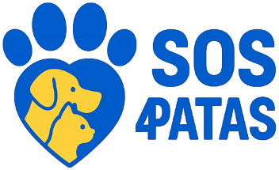

<div align="center">
  <br>
  
  <p>
    
    
    
  </p>
  <br>
</div>

---

## 🌎 Veja Online

> [**Acesse a aplicação aqui**](https://link-sera-adicionado-em-breve.com)  
> *(Adicionaremos o link em breve!)*

---

## 🚀 Sobre

Esta aplicação foi desenvolvida para a **ONG SOS 4 PATAS**, dedicada ao resgate, proteção e adoção de animais.  
O sistema oferece ferramentas administrativas modernas para cadastro, atualização, filtragem e organização dos dados dos animais e usuários, além de funcionalidades para voluntários e gerenciamento interno da ONG.

---

## 📋 Funcionalidades

- Cadastro e gerenciamento de animais (inclusão, edição, exclusão, filtros e busca)
- Gerenciamento de usuários e permissões administrativas
- Gestão de voluntários
- Painel administrativo responsivo e customizado
- Página pública com informações sobre a ONG

---

## ⚙️ Tecnologias Utilizadas

-  **Django 5.2**
-  **Python 3**
-  **HTML5**
-  **CSS3**
-  **JavaScript**
-  **SQLite**

---

## 💻 Como rodar localmente

```bash
# Clone o repositório
git clone https://github.com/marcusvrds07/SOS-4-PATAS.git
cd SOS-4-PATAS

# Crie o ambiente virtual
python -m venv venv
source venv/bin/activate    # Linux/Mac
venv\Scripts\activate       # Windows

# Instale as dependências
pip install -r requirements.txt

# Execute as migrações
python manage.py migrate

# Crie um superusuário
python manage.py createsuperuser

# Rode o servidor local
python manage.py runserver
